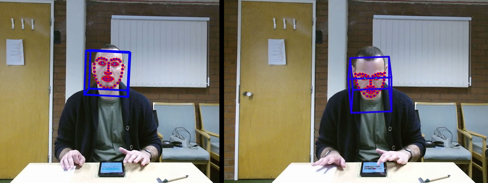
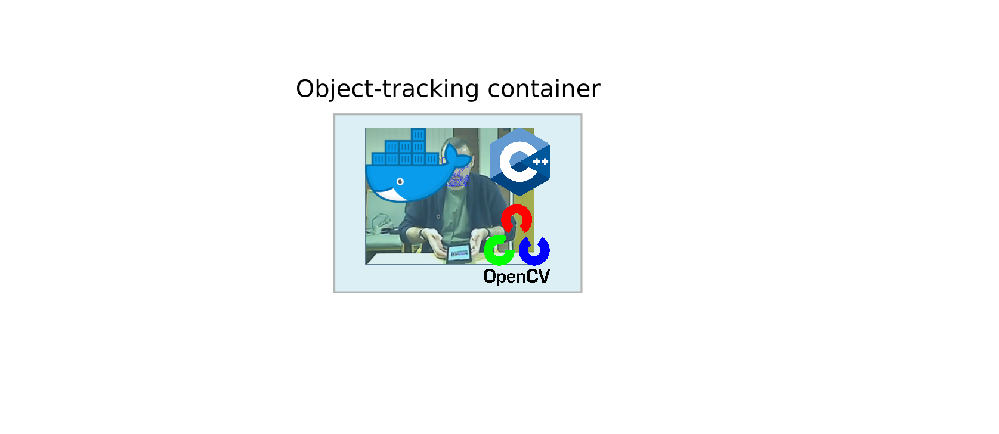
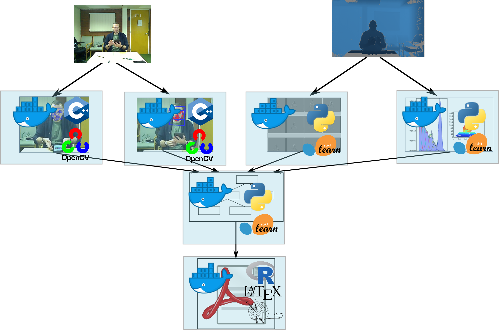

## Caroline's part

* Set background etc.

## David's part

## Self-contained reproducible research papers

* Easier 
* Everything is in R; only external dependency is the data
  + In principle (pretty much) a solved problem
    + Some friction points:
      + package versions (thow everything in Docker / Packrat)
      
      + getting tables how you want them
      + collaboration; e.g. working with Overleaf

## 

##

## What if you can't do everything in R?  

* Complex dependencies
* Time consuming-analyses
* Long pipelines

## Our approach

* Make modular by containerising each step
  + Reusable, reproducible
  + The final module makes the paper
* Join outputs of containers with Makefile

## Example - IDInteraction

- Automate the coding of behaviours
- This is _really_ slow and tedious to do by hand.

 

##

## Docker images
- Each module contains its own Makefile
- Example: object tracking
   

## Docker images {data-transition="none"}
- Each module contains its own Makefile
- Example: object tracking
   

## Docker images {data-transition="none"}

- Each module contains its own Makefile
- Example: object tracking
   

##

  

## Challenges

* Additional complexity
* Requires Docker
* Top-level makefile runs on native system
  + Difficult to move from Linux --> Windows

## Benefits
* Transparency
* Every figure can be traced back to its source
* Reusability and extensibility
* RSE is an integral part of the paper production process ==> appropriate credit

  

## Caroline's wrap up

* Conclusions
