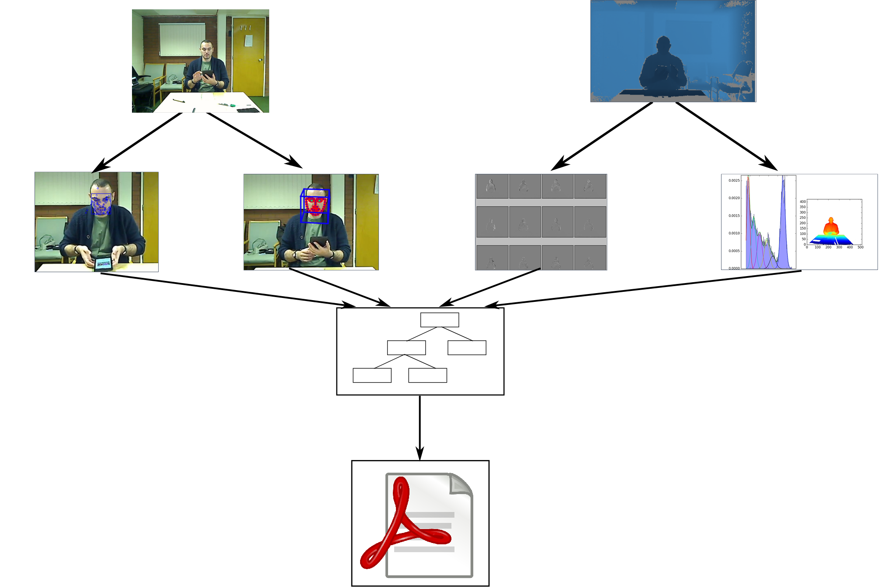
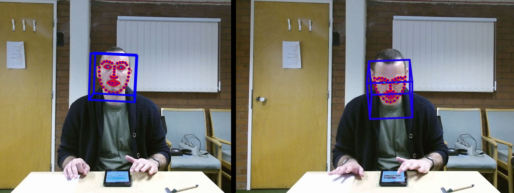
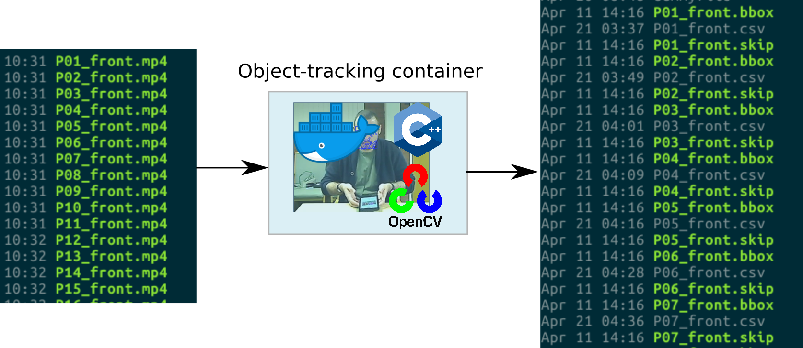
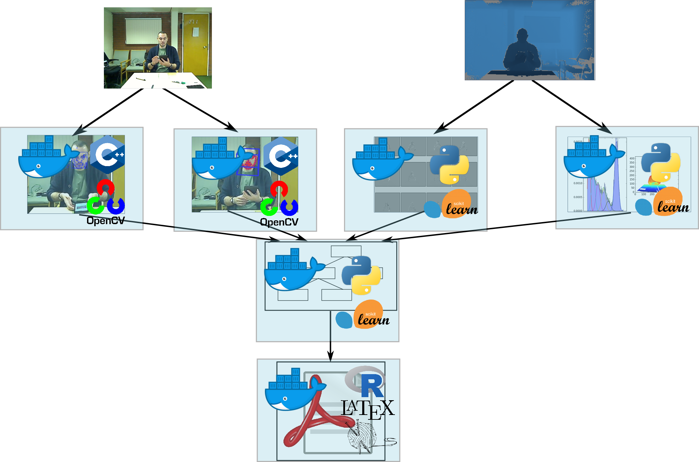

## Reproducible research

## Publishing reproducible research

* How it changes the publication model
* Why this is a good thing for research
* Why this is a good thing for research software engineers

## Self-contained reproducible research papers

* We can write our paper in LaTeX or Markdown, including R code as required
* Everything is in R; the only external dependency is the data
    + In principle (pretty much) a solved problem
* Some friction points:
    + software versions &rarr; Docker or Packrat 
    
    + formatting, e.g. tables
    + collaboration; e.g. working with Overleaf

## 

##

## What if you can't do everything in R?  

* Complex dependencies
* Time consuming-analyses
* Long pipelines

## Our approach

* Make modular by containerising each step using Docker
	  + Reusable, reproducible
	  + The final module makes the paper
* Join outputs of containers with Makefile
	  + Or a workflow management tool

## Example - IDInteraction

- Automate the coding of behaviours
- This is _really_ slow and tedious to do by hand.

 

##

## Docker images
- Each module contains its own Makefile
- Example: object tracking
   

## Docker images {data-transition="none"}
- Each module contains its own Makefile
- Example: object tracking
   

## Docker images {data-transition="none"}

- Each module contains its own Makefile
- Example: object tracking
   

##

  

## Challenges

* Additional complexity
  	+ Pipeline can be difficult to debug
* Requires Docker
* Error handling
* Top-level Makefile can become unwieldy
  	+ Have started using [Nextflow](https://www.nextflow.io) for parts of the process

## Benefits
* Transparency
* Allows others to re-run and extend our analyses
  	+ Re-run, to verify
	+ Re-run, to modify (e.g. bounding box)
	+ Re-run, to extend (e.g. new data, new tracking methods)
* Moves away from the static "one-shot" publication

## A new publication model {data-transition="none"}
* Improves reliability

## A new publication model {data-transition="none"}
* Improves reliability
* Improves efficiency

## A new publication model {data-transition="none"}

* Improves reliability
* Improves efficiency
* Improves effectiveness
  
## A new publication model {data-transition="none"}

* Improves reliability
* Improves efficiency
* Improves effectiveness
* Accelerates progress
  
## Reproducible research / research software engineering {data-transition="none"}
* Narrative remains important
	+ paper construction is becoming less a literary work, and more a software engineering project

## Reproducible research / research software engineering {data-transition="none"}

* Narrative remains important
	+ paper construction is becoming less a literary work, and more a software engineering project
* RSEs are integral to this process

[](Notes: Finish technical bit with a description of what this allows other people to do - allows other people to re-run some of our analysis.  This is how we've made the paper - what does this mean for another researcher who comes to this work - they can rerun these aspects completely.  But bbox placed by a human - someone could explore how variation in placement of bbox affected results, could rerun and compare.  A new experiment, using our paper, updating our paper.  Another potential novel contribution, from the same tool chain.)  

 process; causes us to reflect on the publication model.  What we can't do with (most) standard journals is publish an almost identical looking paper, but with a different data-set.)

